  

  <a href="https://emirhansolmaz.vercel.app"><b>Portfolio</b></a>
  &nbsp;&nbsp;|&nbsp;&nbsp;
  <a href="https://www.linkedin.com/in/emirhansolmaz/"><b>LinkedIn</b></a>
  &nbsp;&nbsp;|&nbsp;&nbsp;
  <a href="mailto:emirhansolmaz2316@gmail.com"><b>Email</b></a>

I write Solidity for Avalanche and build the tools around it. I also ship complete products, from database to deploy, with Next.js, FastAPI and Supabase.

## Now

- **Team1 Turkiye** - collaborator in the Avalanche community.
- **Stellar** - Ambassador.
- **learn-avalanche** - an open-source skill that takes a coding agent from zero Solidity to a custom Avalanche L1. It explains and asks questions, the learner writes the code.

## Selected work

| Project | What it is | Built with |
| :-- | :-- | :-- |
| [**learn&#8209;avalanche**](https://github.com/Anka-1623/learn-avalanche) | AI teacher for Solidity and Avalanche. Install it with `npx skills add Anka-1623/learn-avalanche`. | Python, Solidity, Avalanche |
| [**Team1&nbsp;Calendar**](https://github.com/Anka-1623/team1-turkiye-takvim) | Birthday calendar for Team1 Turkiye. Magic-link sign-in and opt-in email reminders. [Live site](https://team1-turkiye-takvim.vercel.app). | Next.js, Supabase, Tailwind CSS |
| [**esp32-fustool**](https://github.com/Anka-1623/esp32-fustool) | ESP32Marauder fork for screenless ESP32-S3 boards, with a WebUI served by the device. | C++, ESP32-S3, Arduino |
| [**Astrocode**](https://github.com/Anka-1623/astrocode) | Story and simulation game built around the Turkish Space Agency's lunar program. | JavaScript, Phaser |
| **EduTask** | AI-powered student task management. In development. | React, FastAPI, Supabase |

## Stack

  <b>Web3</b>&nbsp;&nbsp;
    

  <b>Frontend</b>&nbsp;&nbsp;
     

  <b>Backend and data</b>&nbsp;&nbsp;
      

## Let's build something

Always up for a conversation about Solidity, Avalanche, or a project worth building. The fastest way to reach me is [email](mailto:emirhansolmaz2316@gmail.com).
